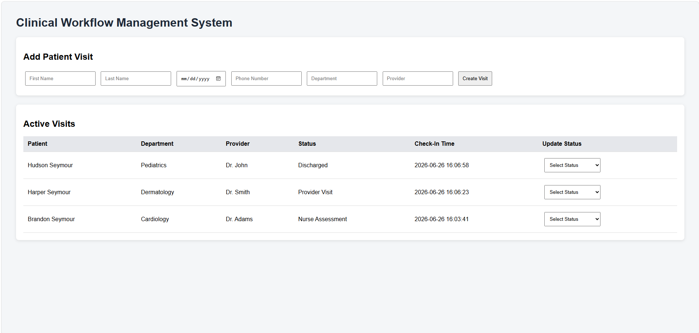
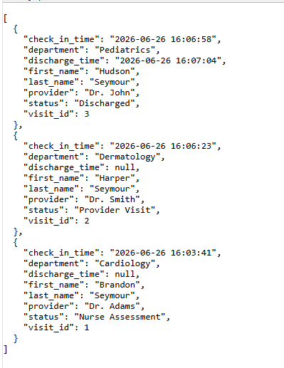
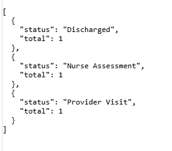

# Clinical Workflow Management System

A healthcare workflow management application designed to simulate patient movement through a clinical visit lifecycle. This project demonstrates healthcare workflow analysis, full-stack development, REST API design, database management, and technical documentation.

---

## Features

- Patient check-in
- Workflow status tracking
- Department management
- Provider assignment
- REST API
- SQLite database
- Workflow reporting

---

## Screenshots

### Main Application

### Active Visits API

### Visit Counts Report

